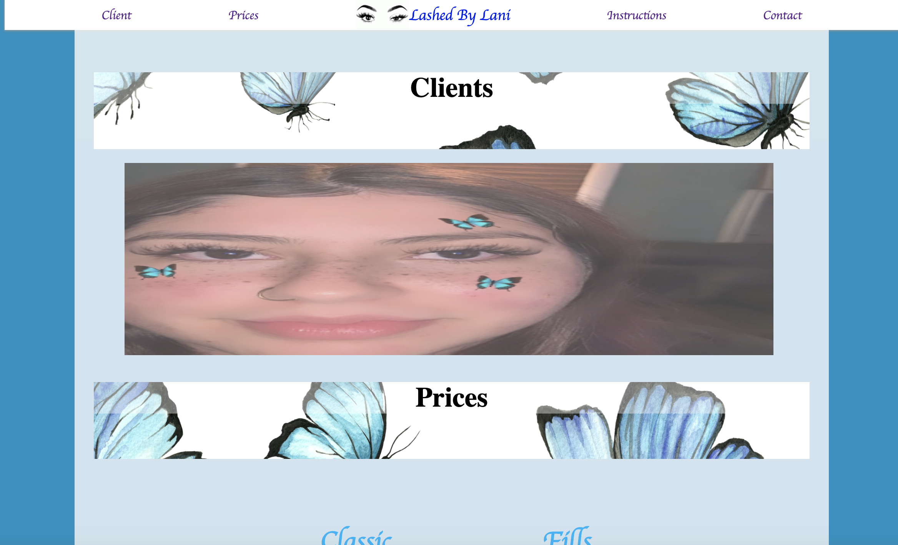
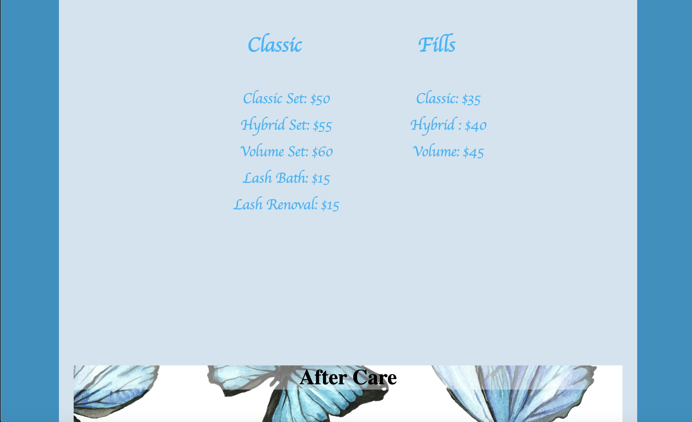
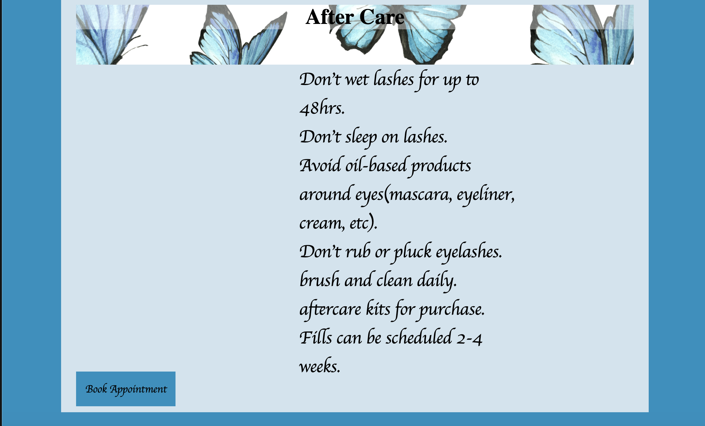
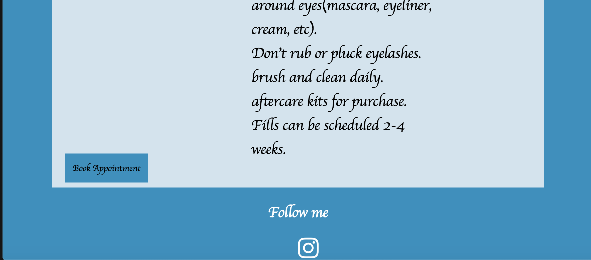
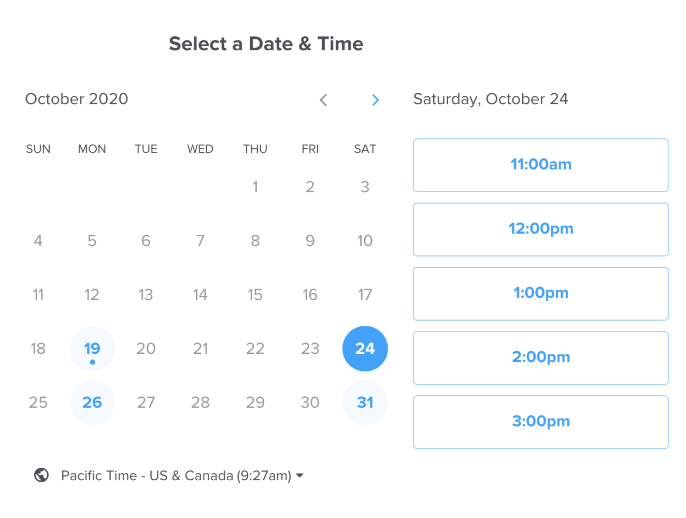
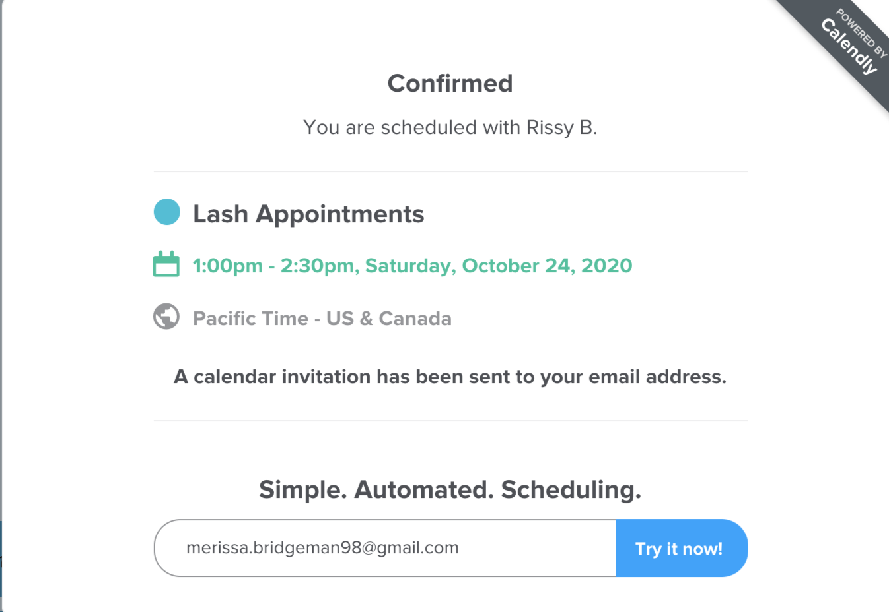

# intensive

Welcome to Lashed By Lani!!

Why I did It:

For my intensive project I decided to create a website to assist one of my closest friends with her new business! 

I wanted to create something that will help her brand stand out and that helped me come up with her color theme/palette for her website. 

I also wanted her to not have to go through social media for her business because while it can help you build a client base, it's hard to keep 

track of all the differnet appointments and having to constantly explain prices, procedures etc.

What's on it: 

On the website, I create a top nav with her logo and name in the middle. I also have four sections two on either side of the logo.

I also created a carousel that shows off what she's done so far. As she progresses in her business, more photos can be added.

There's general info like prices and after care instructions that I split into two sections of the page. This will make it easier for the client

to understand the procedures and decide if they want to make an appointment. I embedded a calendly calendar on the website to make it easier for

Ailani to input her availability for the month and then people can see and schedule based on the availability that she sets. When booking an

appointment they can add any extra comments that will help her prep for the appointment and when scheduled, it'll go straight to her calendar and 

notify her of the appointment.

  
  
  
  
  
  
  
How I coded it: 

I used calendly to embed the calendar on the website, I used the link version and then styled the button myself.

I also linked to a website called fontawesome, this is what helped me get the social media icon onto the website in the footer.

The hardest part was the styling, I added a parallax effect to the different headers because her theme is like a butterfly and I wanted to 

incorporate that somehow. Making it a background section just threw off the flow of the website so I put it as the section headers. I also created

a carousel that I learned from w3schools. This will give her clients some insight on what she is able to do.

Everything else was pretty easy just styled it in a specific color palatte so that it flows nicely.

Lastly, I coded this website for a phone version first because that's where most of the clients will be viewing it on. I need to style it for a

desktop as well.

I hope you all enjoy!
